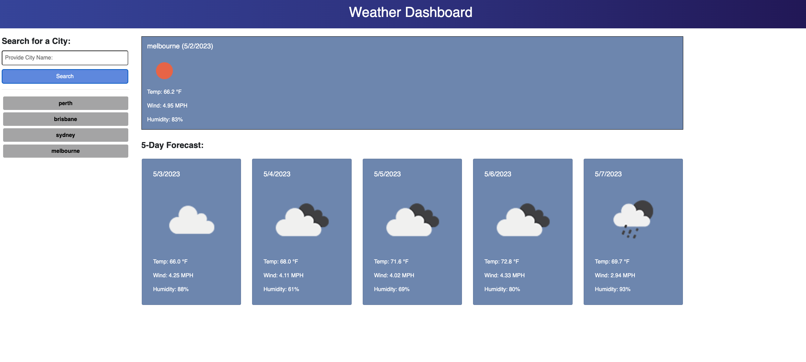

# Server-Side APIs: Weather Dashboard

## Description

Weather dashboard that will run in the browser and feature dynamically updated HTML and CSS.

## GitHub Link
https://github.com/vijaycheruku/WeatherDashboard

## Deployed URL
https://vijaycheruku.github.io/WeatherDashboard/

## Website screenshot

The following image shows the web application's appearance and functionality:

